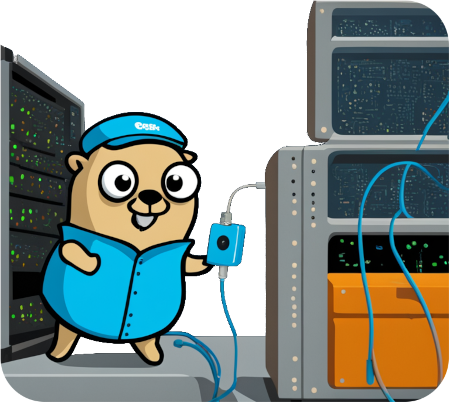

## A Go testing framework for distributed applications

Gont is a Go package to support the development networked and distributed applications.

It can construct a virtual network using Linux network spaces, to simulate switches, routers, NAT and endpoints, on a single machine (VM, cloud or native).
In addition, it supports developers with tooling for tracing and debugger tooling for investigating distributed applications.

Gont is heavily inspired by [Mininet](https://mininet.org).
It allows the user to build virtual network topologies defined Go code.
Under the hood the network is then constructed using Linux virtual bridges and network namespaces.

Gont runs on all moderatly recent Linux versions and requires `NET_ADMIN` capabilities (or root access).

Using Gont, developers can test complex distributed peer-to-peer and federated applications like routing daemons or social networks and messaging.
Integration tests can be automated and executed in CI environments like GitHub actions (which are in fact used to test Gont itself).

## Getting started

Have a look at our **[slide set](https://gont.cunicu.li/slides/)** to get you started.

## Features

-   Various common network nodes:
    -   Standard host
    -   Layer-3 Routers
    -   Layer-2 Switches
    -   Layer-3 NAT Routers
    -   Layer-3 NAT to host networks

-   Hostname resolution for test nodes (/etc/hosts overlay)
-   Execution of sub-processes, Go code & functions in the network namespace of test nodes
-   Simultaneous setup of multiple isolated networks
-   Ideal for Golang unit tests
-   Can run in workflows powered by GitHub's runners
-   Lean code thanks to [functional options](https://sagikazarmark.hu/blog/functional-options-on-steroids/)
-   Full IPv6 support
-   Per link network emulation and bandwidth limiting via for [Netem](https://man7.org/linux/man-pages/man8/tc-netem.8.html) and [TBF](https://man7.org/linux/man-pages/man8/tc-tbf.8.html) queuing disciplines
-   Use of existing network namespaces as nodes
-   Configuration of per-host nftables firewall rules
-   Built-in Ping & Traceroute diagnostic tools
-   Built-in packet tracing with [PCAPng](https://wiki.wireshark.org/Development/PcapNg) output
    - Real-time streaming of PCAPng data to WireShark via [TCP sockets or named-pipes](https://wiki.wireshark.org/CaptureSetup/Pipes.md)
    - Automatic decryption of captured trafic using Wireshark/thark by including session secrets in PCAPng file
    - Automatic instrumentation of sub-processes using [`SSLKEYLOGFILE` environment variable](https://everything.curl.dev/usingcurl/tls/sslkeylogfile)
- Distributed tracing of events
  - A `slog.Handler` to emit [structured log](https://pkg.go.dev/log/slog) records as trace events
  - A `zapcore.Core` to emit [zap](https://github.com/uber-go/zap) log messages as trace events
  - Dedicated [gont/trace](https://pkg.go.dev/github.com/cunicu/gont/v2/pkg/trace) package for emitting trace events
  - Capturing of trace events in PCAPng files
  - WireShark Lua dissector for decoding events
- Built-in [Delve](https://github.com/go-delve/delve) debugger
  - Simultaneous attachment to multiple processes
  - Tracing via HW watch- & breakpoints to emit tracer events (see above)
    - Capture and investigate tracepoints in WireShark
  - Remote debugging via [DAP](https://microsoft.github.io/debug-adapter-protocol/)
  - Generation of VS Code [compound launch configurations](https://code.visualstudio.com/docs/editor/debugging#_compound-launch-configurations)
    - Start Gont test and attach to all processes at once

## Examples

Please refer to [our documentation](https://gont.cunicu.li/examples/)

## Contact

Please have a look at the contact page: [cunicu.li/docs/contact](https://cunicu.li/docs/contact).

### Funding acknowledment

 The development of [Gont][gont] has been supported by the [ERIGrid 2.0][erigrid] project \
of the H2020 Programme under [Grant Agreement No. 870620](https://cordis.europa.eu/project/id/870620)

## License

Gont is licensed under the [Apache 2.0](./LICENSE) license.

- SPDX-FileCopyrightText: 2023 Steffen Vogel \<post@steffenvogel.de\>
- SPDX-License-Identifier: Apache-2.0

[erigrid]: https://erigrid2.eu
[gont]: https://github.com/cunicu/gont
