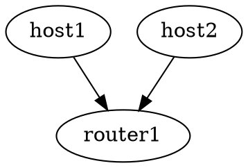

<!-- SPDX-FileCopyrightText: 2023 Steffen Vogel <post@steffenvogel.de>
SPDX-License-Identifier: Apache-2.0 -->

# Gont

### A testing framework for distributed Go applications

---

## Introduction

...

### What does Gont do?

-   Software-defined virtual networking for testing
-   Define hosts, switches, routers in a single host
-   Reentrancy
-   Reproducibility
-   Inspired by [Mininet](http://mininet.org/)

...

### Mininet

> "Mininet creates a realistic virtual network, running real kernel, switch and application code, on a single machine (VM, cloud or native)"

-- [mininet.org](http://mininet.org/)

...

### Mininet

-   Written in Python 2
-   Lacking active maintainer
-   Focus on SDN: OpenFlow controllers
-   No SSL cert on homepage?!

**→** We need something better

...

### Why?

-   Describe network topologies quickly in code
-   Automate construction of complex topologies
-   Unit / CI testing
-   Parallel test execution
-   Example use-cases
    -   VPN / network tools development
    -   SDN Openflow controller development
    -   cunīcu: zeroconf • p2p • mesh • vpn agent
        ([cunīcu](https://github.com/cunicu/cunicu))

---

A little detour:

## Namespaces

(Feel free to [skip this section](#first-some-definitions) if you are
only interested in learning about Gont)

...

### What are Linux namespaces?

...

### They..

-   partition kernel resources
    from **a process-perspective.**
-   power most of Linux containerization tools.
-   appear in many Linux subsystems.
-   are used by many sandboxing solutions in browsers.

...

### Available Linux namespaces

-   **mnt:** Mounts
-   **pid:** Process IDs
-   **net:** Networking
-   **ipc:** Interprocess Communication
-   **uts:** Unix Timesharing (hostname)
-   **user:** User identification & privileges
-   **cgroup:** Process Control Groups
-   **time:** System time

...

### But what exactly is a namespace?

-   Can be identified by a file descriptor
-   A namespace can have multiple processes assigned to it
-   It lives as long as there is still at least one remaining process
-   Child processes inherit parent namespaces

...

### How do I create a namespace?

-   [unshare(2)](https://man7.org/linux/man-pages/man2/unshare.2.html)
-   [clone(2)](https://man7.org/linux/man-pages/man2/clone.2.html)

...

### unshare(2)

```go
func main() {
  err := syscall.Unshare(syscall.CLONE_NEWNS);
}
```

...

### How do I create a namespace?

```go
static int child(void *arg) {
  struct utsname uts;

  sethostname(arg, "ernie")

  uname(&uts)
  printf("nodename in child:  %s\n", uts.nodename);

  return 0;
}

int main() {
  struct utsname uts;

  // Allocate stack for child
  char *stack = malloc(STACK_SIZE);
  if (stack == NULL)
    return -1;

  // Start new kernel task in new UTS namespace
  pid_t child_pid = clone(child, stack + STACK_SIZE, CLONE_NEWUTS | SIGCHLD, NULL);

  // Output hostname
  uname(&uts)
  printf("nodename in parent:  %s\n", uts.nodename);
}
```

...

### How can I share a namespace with other processes?

-   By forking with
    [clone(2)](https://man7.org/linux/man-pages/man2/clone.2.html)
-   By passing file descriptor and
    [setns(2)](https://man7.org/linux/man-pages/man2/setns.2.html)

...

### Joining namespace of another process: /proc

You can join the namespace of another process by using [/proc/{pid}/ns/\*](https://man7.org/linux/man-pages/man5/proc.5.html)

```go
fd := syscall.Open("/proc/1234/ns/uts", syscall.O_RDONLY);
err := unix.Setns(fd, syscall.CLONE_NEWUTS);
```

**Note:** Can only set a single namespace per `netns(2)` invocation.

...

### Joining namespace of another process: pidfd_open

You can join the namespace of another process by using [pidfd\_open(2)](https://man7.org/linux/man-pages/man2/pidfd_open.2.html)

```go
pid_t pid = 1234;
int fd = pidfd_open(pid, 0);

setns(fd, CLONE_NEWUTS | CLONE_NEWNET);
 ```

**Note:** Can only set a multiple namespaces per `netns(2)` invocation.

...

### Persisting namespaces

```go
err := syscall.Mount("/proc/self/ns/uts",
                     "/home/acs/my_uts_namespace", "", syscall.MS_BIND, nil);
```

And in another process...

```go
fd := syscall.Open("/home/acs/my_uts_namespace", syscall.O_RDONLY);
err := unix.Setns(fd, syscall.CLONE_NEWUTS);
```

---

Back to Gont...

## First some definitions

...

- **network**

  A set of *nodes* and *links* between them

...

- **node**

  A network namespace which represents any device in the *network*

...

- **link**

  A pair of `veth` network interfaces which are associated to separate *nodes*

...

- **interface**

  an endpoint with one or more assigned IP addresses

...

- **switch**

  A *node* containing a Linux layer 2 bridge and attached *interfaces*

...

- **host**

  A *node* with several configured *interfaces*

...

- **router**

  A *host* with IP forwarding enabled

...

- **nat**

  A special type of *router* which implements network address translation between a set of south- and north-bound *interfaces*

...

### Relationships


...

### Gont and Namespaces

-   for each *node*:
    -   a separate network namespace
    -   a separate uts namespace
        -   for a unique hostname within each *node*
-   for each *network*:
    -   a separate mount namespace
        -   for a unique `/etc/hosts` files between *networks*

---

## Examples

### Show me some code!

**⚠️ Warning:** Please note that these examples are show just for demonstration purposes and might not compile.

...

### Detailed examples

Have a look at the following code for full fledged test/example code:

<!-- .slide: class="smaller-list" -->
-   [Ping](https://github.com/cunicu/gont/blob/main/pkg/ping_test.go)
-   [Run](https://github.com/cunicu/gont/blob/main/pkg/run_test.go)
-   [NAT](https://github.com/cunicu/gont/blob/main/pkg/nat_test.go)
-   [Switch](https://github.com/cunicu/gont/blob/main/pkg/switch_test.go)
-   [Links](https://github.com/cunicu/gont/blob/main/pkg/link_test.go)
-   [Firewall
    Rules](https://github.com/cunicu/gont/blob/main/pkg/filter_test.go)
-   [Packet
    Tracing](https://github.com/cunicu/gont/blob/main/pkg/capture_test.go)
-   [Event
    Tracing](https://github.com/cunicu/gont/blob/main/pkg/trace_test.go)
-   [Tracing with TLS
    decryption](https://github.com/cunicu/gont/blob/main/pkg/capture_keylog_test.go)
-   [Debugger](https://github.com/cunicu/gont/blob/main/pkg/debug_test.go)

---

## Basic networking

...

### Two directly connected hosts

```go
import gont "github.com/cunicu/gont/v2/pkg"
import opt "github.com/cunicu/gont/v2/pkg/options"

 ...

network, _ := gont.NewNetwork("mynet")

host1, _ := network.AddHost("host1")
host2, _ := network.AddHost("host2")

network.AddLink(
  gont.NewInterface("eth0", host1, opt.AddressIP("10.0.0.1/24")),
  gont.NewInterface("eth0", host2, opt.AddressIP("10.0.0.2/24")))

host1.Ping(host2)
```

(We `opt` throughout these examples as an import alias)

...

### Lets add a L2 switch

```go
switch1, _ := network.AddSwitch("switch1")

host1, _ := network.AddHost("host1",
  gont.NewInterface("eth0", switch1,
    opt.AddressIP("10.0.0.1/24")))

host2, _ := network.AddHost("host2",
  gont.NewInterface("eth0", switch1,
    opt.AddressIP("10.0.0.2/24")))

host1.Ping(host2)
```

...

### How about a L3 router?

```go
switch1, _ := network.AddSwitch("switch1")
switch2, _ := network.AddSwitch("switch2")

host1, _ := network.AddHost("host1",
  gont.NewInterface("eth0", switch1,
    opt.AddressIP("10.0.0.2/24")))
host2, _ := network.AddHost("host2",
  gont.NewInterface("eth0", switch2,
    opt.AddressIP("10.0.1.2/24")))

network.AddRouter("router1",
  gont.NewInterface("eth0", sw1, opt.AddressIP("10.0.0.1/24")),
  gont.NewInterface("eth1", sw2, opt.AddressIP("10.0.1.1/24")))

host1.Ping(host2)
```

...

### Lets do some evil NATing 😈

```go
switch1, _ := network.AddSwitch("switch1")
switch2, _ := network.AddSwitch("switch2")

host1, _ := network.AddHost("host1",
  gont.NewInterface("eth0", switch1,
    opt.AddressIP("10.0.0.2/24")))
host2, _ := network.AddHost("host2",
  gont.NewInterface("eth0", switch2,
    opt.AddressIP("10.0.1.2/24")))

network.AddNAT("n1",
  gont.NewInterface("eth0", switch1,
    opt.SouthBound,
    opt.AddressIP("10.0.0.1/24")),
  gont.NewInterface("eth1", switch2,
    opt.NorthBound,
    opt.AddressIP("10.0.1.1/24")))

host1.Ping(host2)
```

...

### How about a whole chain of routers?

```go
var firstSwitch *gont.Switch = network.AddSwitch("switch0")
var lastSwitch  *gont.Switch = nil

for i := 1; i < 100; i++ {
  switchName := fmt.Printf("switch%d", i)
  routerName := fmt.Printf("router%d", i)

  newSwitch, _ := network.AddSwitch(switchName)

  network.AddRouter(routerName,
    gont.NewInterface("eth0", lastSwitch,
      opt.AddressIP("10.0.0.1/24")),
    gont.NewInterface("eth1", newSwitch,
      opt.AddressIP("10.0.1.1/24"))
  )

  lastSwitch = newSwitch
}

host1, _ := network.AddHost("host1",
  gont.NewInterface("eth0", firstSwitch,
    opt.AddressIP("10.0.0.2/24")))
host2, _ := network.AddHost("host2",
  gont.NewInterface("eth0", lastSwitch,
    opt.AddressIP("10.0.1.2/24")))

host1.Ping(host2)
```

---

## Running your application

Inside the network namespaces / hosts

...

### exec.Cmd API

```go
// Get a exec.Cmd-like struct
cmd := host1.Command("ping", "host2")
out, err := cmd.CombinedOutput()

// Directly run a simple process synchronously
cmd, err := host1.Run("ping", "host2")

// Directly start asynchronously
cmd, err := host1.Start("ping", "host2")

time.Sleep(5 * time.Second)

err = cmd.Process.Signal(os.Interrupt)
cmd.Wait()
```

The `gont.Node` type implements an API similar to the one provided by Go's
`exec` package.

...

### Pass options

```go
import copt "github.com/cunicu/gont/v2/pkg/options/cmd"

outb := &bytes.Buffer{}

cmd := host1.Command("ping", "1.1.1.1",
  copt.DisableASLR(true),
  copt.Dir("/custom/working/dir"),
  copt.EnvVar("DEBUG", "1"),
  copt.Stdin(...), // pass any io.Reader
  copt.Stdout(outb), // pass any io.Writer (can be repeated)
  copt.Stderr(...), // pass any io.Writer (can be repeated)
)

print(outb.String())
```
...

### Pass non-string arguments

```go
ip := net.ParseIP("1.1.1.1")

cmd := host1.Command("ping", "-c", 10, "-i", 0.1, ip)
```

...

### Go functions

```go
host1.RunFunc(func() {
  r := http.Get("http://host2:8080")
  io.Copy(os.Stdout, r.Body)
})
```

Call a function inside a network namespace of host `host1` but still
in the same process so you can use channels and access global variables.

**⚠️ Warning:** Spawning Goroutines from within the callback
is only indirectly supported:

```go
host1.RunFunc(func() {
  go host1.RunFunc(func() { ... })
})
```

...

### Go packages

```go
cmd, err := host1.RunGo("test/prog.go", "arg1")
```

---

## Firewall

by Netfilter's nftables

...

### Add some firewall rules for a host

```go
import fopt "github.com/cunicu/gont/v2/options/filter"

_, src, _ := net.ParseCIDR("10.0.0.1/32")

host1, _ := network.AddHost("host1",
  opt.Filter(
    gont.FilterInput,
      fopt.Source(src),
      fopt.Protocol(unix.AF_INET),
      fopt.TransportProtocol(unix.IPPROTO_TCP),
      fopt.SourcePortRange(0, 1024)))
```

---

## Network Emulation

by Linux's Traffic Control: Netem Qdisc

...

### Attach a netem Qdisc to an interface

```go
import tcopt "github.com/cunicu/gont/v2/options/tc"

network.AddLink(
  gont.NewInterface("eth0", host1,
    opt.WithNetem(
      tcopt.Latency(50 * time.Millisecond),
      tcopt.Jitter(5 * time.Millisecond),
      tcopt.Loss(0.1),
    ),
    opt.AddressIP("10.0.0.1/24")),
  gont.NewInterface("eth0", host2,
    opt.AddressIP("10.0.0.2/24")),
)

host1.Ping(host2)
```

---

## Packet captures

PCAP, WireShark, tshark

...

### Write to packets to

Gont merges and sorts packet captures in real-time
from multiple interfaces and records them to one of the following sinks:

-  Using [PCAPng](https://github.com/pcapng/pcapng) format
    -  Regular files
    -  Named pipes
    -  TCP / UDP / Unix listeners
    -  WireShark real-time stream
-  Go channels
-  Go callback functions.

...

### Filtering

Captured network traffic can be filtered by

-   Selected Gont nodes and interfaces
-   eBPF filter programs
-   [pcap-filter(7)](https://www.tcpdump.org/manpages/pcap-filter.7.html)
    expressions
-   Go callback functions (⚠ slow!)

...

### Session key logging

Most transport layer encryption protocols today provide [perfect forward
secrecy](https://en.wikipedia.org/wiki/Forward_secrecy) by using
short-lived ephemeral session keys.

Gont offers a feature to log these session keys into a PCAPng file to
enable a decryption of upper layer protocols with a dissector tool like
Wireshark.

...

### Example


---

## Distributed Tracing

User defined events, Log messages

...

### A trace event

Gont supports collecting trace events from all processes running in a
distributed system which can carry the following information. Gont
orders trace events by time and saves them to different destinations for
analysis.

```go
type Event struct {
  Timestamp time.Time // Timestamp when the event occurred
  Type      string    // Either: 'log', ́'trace', 'break' & ́ watchpoint'
  Level     uint8     // Log level
  Message   string    // A human readable description
  Source    string    // Logger name
  PID       int 
  Function  string
  File      string
  Line      int
  Args      []any
  Data      any       // User defined data
}
```

...

### Sink trace events into

-   JSON files
-   Go channels
-   Go callbacks
-   Packet captures

...

### Create a tracer

```go
import "cunicu.li/gont/v2/trace"
import topt "github.com/cunicu/gont/v2/options/trace"

c := gont.NewCapture(...)
f, _ := os.OpenFile(...)
ch := make(chan trace.Event)

t := gont.NewTracer(
  topt.ToFile(f)
  topt.ToFilename("trace.log"),
  topt.ToChannel(ch),
  topt.ToCapture(c),
  topt.Callback(func(e trace.Event) { ... }))

t.Start()
```

...

### Attach the tracer

Trace all processes started by nodes of this network

```go
network, _ := gont.NewNetwork("", t)
```

Trace all processes started by a node

```go
host1 := network.NewHost("host1", t)
```

Trace a single process

```go
host1.RunGo("test/main.go", t)
```

...

### Trace with the `trace` package

```go
import "cunicu.li/gont/v2/pkg/trace"

someData := map[string]string{"Hello": "World"}
count := 42

trace.Start(0)

trace.PrintfWithData(someData, "Count is: %d", count)
trace.Print("Another message")

trace.Stop()
```

Works from:

-  Gont process itself
-  Any process spawned via Gont's
   `Host.{Command,Run,RunGo,Start,StartGo}(...)` functions

...

### Trace via `slog` structured logging package

```go
import "log/slog"
import "cunicu.li/gont/v2/pkg/trace"

// Create a slog handler which emits trace events
handler := trace.NewTraceHandler(slog.HandlerOptions{})

// Add the tracing option which emits a trace event for each log message
logger := slog.New(handler)
```

Each log message emits a trace event which includes the log message,
filename, line number as well function name and more.
Any fields passed to to zap structured logger are included in the `Data`
field of the `Event` structure.

...

### Trace via `go.uber.org/zap` logging package

```go
import "go.uber.org/zap"
import "cunicu.li/gont/v2/pkg/trace"

// Add the tracing option which emits a trace event for each log message
logger := zap.NewDevelopment(trace.Log())

// Add the caller info which gets also included in the trace event
logger = logger.WithOptions(zap.AddCaller())

// Give the logger some name which is added as the Source field to the trace event
logger = logger.Named("my-test-logger")
```

Each log message emits a trace event which includes the log message,
filename, line number as well function name and more.
Any fields passed to to zap structured logger are included in the `Data`
field of the `Event` structure.

---

## Distributed Debugging

powered by Delve

...

### Introduction

Gont can manage Delve debugger instances attached to spawned
sub-processes. These Delve instances can be used to debug or trace
multiple applications in a distributed system simultaneously. Users can
either use DAP-compatible IDEs like VScode to attach to those processes,
or record tracepoint data generated by Delve break- & watchpoints to a
PCAPng file.

Its integration with the packet capture and event tracing feature of
Gont allows the user to even streaming tracepoint data interleaved with
packet and other tracing data in real-time to Wireshark.

...

### Create a debugger

```go
import dopt "cunicu.li/gont/v2/pkt/options/debug"

t := gont.NewTracer(...)

d := gont.NewDebugger(
  // ... Tracepoints are defined her
  dopt.BreakOnEntry(true),
  dopt.ToTracer(t),

  // Listening socket for connection of external DAP client
  dopt.ListenAddr("tcp:[::]:1234"))
```

...

### Attach a debugger

Debug all processes started by nodes of this network:

```go
network, _ := gont.NewNetwork("", d)
```

Debug all processes started by a node:

```go
host1 := network.NewHost("host1", d)
```

Debug a single process:

```go
host1.RunGo("test/main.go", d)
```

(Like for the event tracing)

...

### Define tracepoints

...

#### Break-, watchpoint location

```go
import "github.com/go-delve/delve/service/api"
import dopt "cunicu.li/gont/v2/pkg/options/debug"

d := gont.NewDebugger(
  gont.NewTracepoint(
    dopt.Disabled(false),
    dopt.Name("tp1"),
    dopt.Message("A trace message with evaluated {placeholders}"),
    dopt.Location(...), // A Delve locspec
    dopt.Address(0x12312321),
    dopt.File("main.go"),
    dopt.Line(12),
    dopt.FunctionName("main.main"),
    dopt.FunctionNameRegex("main\.(main|setupLogger)"),
    dopt.Condition("i % 100 == 0"),
    dopt.HitCondition("> 100"),
    dopt.HitConditionPerGoroutine(true),
    dopt.Watch("p", api.WatchRead|api.WatchWrite)),
  ...
)
```

...

### Define tracepoints

...

#### Gathering of breakpoint information

```go
import dopt "cunicu.li/gont/v2/pkt/options/debug"

d := gont.NewDebugger(
  gont.NewTracepoint(
    ...
    dopt.Variable("j"),
    dopt.Goroutine(true),
    dopt.Stacktrace(10),
    dopt.LoadLocals(...),
    dopt.LoadArguments(
      dopt.FollowPointers(true),
      dopt.MaxVariableRecurse(3),
      dopt.MaxStringLen(128),
      dopt.MaxArrayValues(128),
      dopt.MaxStructFields(32))))
```

...

### VSCode Integration

Gont generates VS Code launch compound configurations based on the
active debugging sessions.

```go
d.WriteVSCodeConfigs("", false)
```

---

### Topology factories (WIP)

```go
createHost := func(pos int) (*gont.Host. error) {
  return network.AddHost(fmt.Sprintf("h%d", pos))
}

linkHosts := func(a, b *gont.Node) error {
  _, err := network.AddRouter(fmt.Sprintf("r%d", pos),
    gont.NewInterface("eth0", a, opt.AddressIPv4(10, 0, 0, a.Position, 24),
    gont.NewInterface("eth1", b, opt.AddressIPv4(10, 0, 0, b.Position, 24)
  )
  return err
}

topo.Linear(n, 100, createHost, linkHosts)

network.Nodes["h0"].Traceroute(network.Nodes["h99"])
```

---

## CLI utility

...

### CLI Example

Make network persistent

```go
network, _ := gont.NewNetwork("mynet",
  opt.Persistent(true))
```

Introspect network after creation with `gontc`

```sh
$ gontc list
mynet

$ gontc list mynet
mynet/host1
mynet/host2

$ gontc exec mynet/host1 hostname
host1.mynet.gont

$ gontc shell mynet/host1
$ mynet/host1: ip address show
```

...

### CLI Usage

```text
Usage: gontc [flags] <command>

    Supported <commands> are:

      identify                               return the network and node name if gontc is executed within a network namespace
      shell [<net>]/<node>                   get an interactive shell inside <node>
      exec  [<net>]/<node> <command> [args]  executes a <command> in the namespace of <node> with optional [args]
      list  [<net>]                          list all active Gont networks or nodes of a given network
      clean [<net>]                          removes the all or just the specified Gont network
      help                                   show this usage information
      version                                shows the version of Gont

   Example:

      gontc exec zorn/host1 ping host2

   Gont - The Go network tester
      Author Steffen Vogel <post@steffenvogel>
```

---

## How do I use it?

...

### Gont ...

-   can be used in Go unit & integration-tests
    -   on Github-powered CI runners
-   is licensed under Apache-2.0
-   is available at
    [github.com/cunicu/gont](https://github.com/cunicu/gont)
-   is documented at
    [pkg.go.dev/cunicu.li/gont/v2](https://pkg.go.dev/cunicu.li/gont/v2)
-   has slides at [cunicu.github.io/gont](https://cunicu.github.io/gont)

...

### Requirements

-   Go 1.19
-   A moderate recent Linux kernel (&gt;= 4.9)
    -   `mnt` and `net` namespace support
-   root access / `NET_ADMIN` caps
-   traceroute userspace tool
-   libpcap for packet captures

...

### Roadmap

-   Use pure Go implementation of traceroute
-   More topology factories
-   Design a nice logo
-   A Graphviz output for topology visualization
-   Automatic address assignment
-   Parser for network topologies from
    [Dot](https://graphviz.org/doc/info/lang.html),
    [YAML](https://yaml.org/) or [JSON](https://www.json.org/)
    description.

...

#### Dot example




---

### Thanks for your attention

Steffen Vogel

[@stv0g](https://github.com/stv0g), <stv0g@0l.de>

[](https://www.acs.eonerc.rwth-aachen.de)


The development of Gont has been supported by the [ERIGrid
2.0](https://erigrid2.eu) project of the host2020 Programme under [Grant
Agreement No. 870620](https://cordis.europa.eu/project/id/870620).
