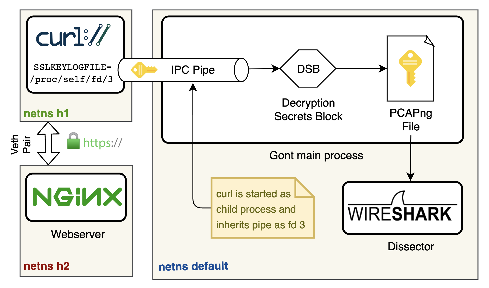

# Packet captures

Powered by [PCAPng](https://pcapng.com/), [WireShark](https://www.wireshark.org/), [tshark](https://www.wireshark.org/docs/man-pages/tshark.html)

## Write to packets to

Gont merges and sorts packet captures in real-time
from multiple interfaces and records them to one of the following sinks:

-  Using [PCAPng](https://github.com/pcapng/pcapng) format
    -  Regular files
    -  Named pipes
    -  TCP / UDP / Unix listeners
    -  WireShark real-time stream
-  Go channels
-  Go callback functions.

## Filtering

Captured network traffic can be filtered by

-   Selected Gont nodes and interfaces
-   eBPF filter programs
-   [pcap-filter(7)](https://www.tcpdump.org/manpages/pcap-filter.7.html) expressions
-   Go callback functions (⚠ slow!)

## Session key logging

Most transport layer encryption protocols today provide [perfect forward secrecy](https://en.wikipedia.org/wiki/Forward_secrecy) by using short-lived ephemeral session keys.

Gont offers a feature to log these session keys into a PCAPng file to enable a decryption of upper layer protocols with a dissector tool like Wireshark.

## Example

