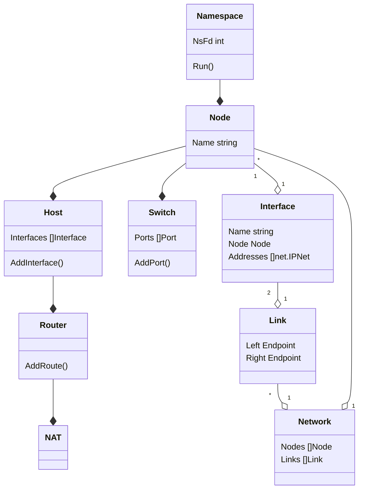

# Definitions

- **network**: A set of *nodes* and *links* between them
- **node**: A network namespace which represents any device in the *network*
- **link**: A pair of `veth` network interfaces which are associated to separate *nodes*
- **interface**: an endpoint with one or more assigned IP addresses
- **switch**: A *node* containing a Linux layer 2 bridge and attached *interfaces*
- **host**: A *node* with several configured *interfaces*
- **router**: A *host* with IP forwarding enabled
- **nat**: A special type of *router* which implements network address translation between a set of south- and north-bound *interfaces*

## Relationships

## Gont and Namespaces

-   For each *node*:
    -   A separate network namespace
    -   A separate UTS namespace
        -   For a unique hostname within each *node*
-   For each *network*:
    -   A separate mount namespace
        -   For a unique `/etc/hosts` files between *networks*

