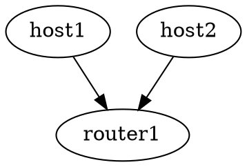

# Topology Visualization

```dot
digraph D {
    /* network options */
    persistent = true

    /* nodes */
    host1 [type=host, exec="ping host2"]
    host2 [type=host]
    router1 [type=router]

    /* links */
    host1 -> router1 [address="10.0.0.1/24",
              mtu=9000]
    host2 -> router1 [address="10.0.0.2/24",
              mtu=9000]
}
```

